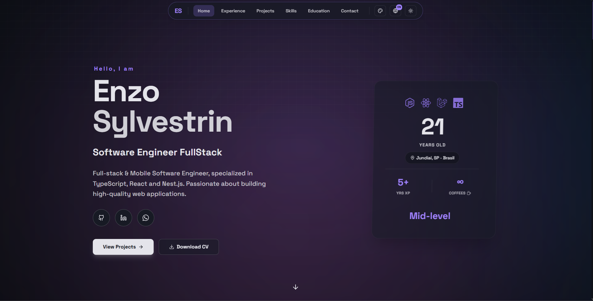

<div align="center">

# 🎨 Portfolio V2 - Enzo Sylvestrin

### Portfolio profissional de última geração construído com Next.js 16



[](https://nextjs.org/)
[](https://www.typescriptlang.org/)
[](https://tailwindcss.com/)
[](https://upstash.com/)

[🌐 Demo ao Vivo](https://enzopavani.dev) • [📝 Documentação](#-recursos) • [🚀 Começar](#-começando)

</div>

---

## ✨ Recursos Principais

### 🎯 Design & UX
- ✅ **Design Premium**: Interface moderna com gradientes, glassmorphism e micro-animações
- ✅ **Modo Escuro/Claro**: Transição suave com animação circular
- ✅ **Temas Personalizáveis**: 10+ paletas de cores (Purple, Blue, Green, etc.)
- ✅ **Tooltips Informativos**: Guias visuais para recursos do site
- ✅ **Responsive Design**: Otimizado para mobile, tablet e desktop
- ✅ **Efeitos de Background**: Aurora, Meteors e iluminação ambiente
- ✅ **Scroll Progress Bar**: Barra de progresso sutil no topo da página
- ✅ **Botão "Voltar ao Topo"**: Aparece inteligentemente quando o usuário demonstra intenção de retornar

### 🌍 Internacionalização
- ✅ **Multilíngue**: Suporte completo para Português e Inglês
- ✅ **Troca Instantânea**: Alternância de idioma sem reload
- ✅ **SEO Multi-idioma**: Otimizado para ambos os idiomas

### 🚀 Performance & SEO
- ✅ **Next.js 16**: App Router com React Server Components
- ✅ **SEO Completo**: Meta tags, Open Graph, Twitter Cards
- ✅ **Schema.org**: JSON-LD estruturado (Person + WebSite)
- ✅ **Sitemap & Robots.txt**: Indexação otimizada
- ✅ **PWA Ready**: Manifest e ícones configurados
- ✅ **Cache Inteligente**: Next.js cache API com revalidação (60s)
- ✅ **Imagem Open Graph**: Preview profissional para redes sociais

### 📊 Features Interativas
- ✅ **Contador de Visitas**: Redis + Upstash para tracking único por IP (24h)
- ✅ **Navegação Scroll Spy**: Menu atualiza conforme scroll
- ✅ **Animações Suaves**: Framer Motion para transições premium
- ✅ **Cards de Projeto**: Magic Cards com hover effects
- ✅ **Skills com Tooltips**: Informações detalhadas ao passar o mouse
- ✅ **Console Easter Egg**: ASCII art com links de contato para desenvolvedores curiosos

### 🎨 Sistema de Temas
- ✅ **Color Picker Animado**: Modal customizado com 10 cores pré-definidas
- ✅ **Persistência**: Tema salvo em cookies
- ✅ **CSS Variables**: Sistema dinâmico baseado em HSL
- ✅ **Transições**: View Transitions API para mudanças suaves
- ✅ **Auto-hint Inicial**: Tooltip da paleta aparece na primeira visita

### ♿ Acessibilidade
- ✅ **Reduced Motion**: Respeita preferência de animações reduzidas do sistema
- ✅ **Framer Motion Config**: Ajuste automático de animações baseado em preferências
- ✅ **CSS Media Queries**: Desabilita animações quando necessário
- ✅ **Navegação por Teclado**: Todos os elementos interativos acessíveis via teclado
- ✅ **ARIA Labels**: Labels descritivos para screen readers
- ✅ **Semantic HTML**: Estrutura HTML semântica e acessível

---

## 🛠️ Stack Tecnológica

### Core
- **[Next.js 16](https://nextjs.org/)** - Framework React com App Router
- **[TypeScript](https://www.typescriptlang.org/)** - Tipagem estática
- **[Tailwind CSS v4](https://tailwindcss.com/)** - Estilização utility-first
- **[Bun](https://bun.sh/)** - Runtime e package manager ultra-rápido

### UI & Animações
- **[Framer Motion](https://www.framer.com/motion/)** - Animações declarativas
- **[Radix UI](https://www.radix-ui.com/)** - Componentes acessíveis
- **[Lucide React](https://lucide.dev/)** - Ícones modernos
- **[Simple Icons](https://simpleicons.org/)** - Ícones de tecnologias

### Internacionalização
- **[next-intl](https://next-intl-docs.vercel.app/)** - i18n completo
- Arquivos de tradução JSON (`pt.json`, `en.json`)

### Backend & Dados
- **[Upstash Redis](https://upstash.com/)** - Database serverless para contador de visitas
- **[next/cache](https://nextjs.org/docs/app/building-your-application/caching)** - Sistema de cache otimizado

### SEO & Analytics
- **Open Graph** - Tags para redes sociais
- **Schema.org** - Dados estruturados JSON-LD
- **Sitemap dinâmico** - Geração automática de sitemap.xml
- **Manifest PWA** - Suporte para instalação como app

---

## 🚀 Começando

### Pré-requisitos
- Node.js 18+ ou Bun
- Conta no [Upstash](https://upstash.com/) (gratuita) para o contador de visitas

### Instalação

```bash
# Clone o repositório
git clone https://github.com/EnzoSylvestrin/portfolio-v2.git
cd portfolio-v2

# Instale as dependências
bun install
# ou
npm install

# Configure as variáveis de ambiente
# Crie um arquivo .env na raiz do projeto
cp .env.example .env
```

### Configuração do Redis (Opcional)

Se quiser usar o contador de visitas:

1. Crie uma conta gratuita em [Upstash Console](https://console.upstash.com/)
2. Crie um novo database Redis
3. Adicione as credenciais no `.env`:
   ```env
   UPSTASH_REDIS_REST_URL=sua_url_aqui
   UPSTASH_REDIS_REST_TOKEN=seu_token_aqui
   ```

### Desenvolvimento

```bash
# Inicie o servidor de desenvolvimento
bun dev
# ou
npm run dev

# Acesse http://localhost:3000
```

### Build para Produção

```bash
# Gere o build otimizado
bun run build

# Inicie o servidor de produção
bun start
```

---

## 📁 Estrutura do Projeto

```
portfolio-v2/
├── src/
│   ├── app/                    # App Router (Next.js 16)
│   │   ├── api/               # API Routes
│   │   │   └── visits/        # Contador de visitas
│   │   ├── layout.tsx         # Layout raiz com SEO
│   │   ├── page.tsx           # Página inicial
│   │   ├── sitemap.ts         # Sitemap dinâmico
│   │   ├── robots.ts          # Robots.txt
│   │   └── manifest.ts        # PWA Manifest
│   ├── components/
│   │   ├── main/              # Componentes principais
│   │   │   ├── sections/      # Seções do portfolio
│   │   │   │   ├── hero/      # Seção Hero
│   │   │   │   ├── skills/    # Skills com tooltips
│   │   │   │   ├── projects/  # Projetos destacados
│   │   │   │   ├── experience/# Experiência profissional
│   │   │   │   ├── education/ # Educação
│   │   │   │   └── contact/   # Contato
│   │   │   └── utils/         # Header, Footer
│   │   ├── ui/                # Componentes UI reutilizáveis
│   │   │   ├── tooltip.tsx    # Sistema de tooltips
│   │   │   ├── scroll-progress.tsx # Barra de progresso
│   │   │   ├── back-to-top.tsx     # Botão voltar ao topo
│   │   │   ├── console-art.tsx     # ASCII art no console
│   │   │   └── ...
│   │   └── theme-provider.tsx # Provedor de tema
│   ├── hooks/
│   │   └── use-reduced-motion.ts # Hook de acessibilidade
│   ├── data/                  # Dados JSON
│   │   └── main/
│   │       ├── skills.json    # Habilidades técnicas
│   │       ├── projects.json  # Projetos
│   │       ├── experience.json# Experiências
│   │       ├── education.json # Formação
│   │       └── contact.json   # Informações de contato
│   ├── lib/
│   │   ├── schema.ts          # Schema.org JSON-LD
│   │   └── utils.ts           # Utilitários
│   └── styles/
│       └── globals.css        # Estilos globais e CSS variables
├── messages/                  # Traduções i18n
│   ├── pt.json               # Português
│   └── en.json               # Inglês
└── public/                   # Assets estáticos
    ├── opengraph-image.png   # Imagem para redes sociais
    └── ...
```

---

## 🎨 Customização

### 1. Dados Pessoais

Edite os arquivos JSON em `src/data/main/`:

- **`skills.json`** - Suas habilidades técnicas
- **`projects.json`** - Projetos destacados
- **`experience.json`** - Histórico profissional
- **`education.json`** - Formação acadêmica
- **`contact.json`** - Informações de contato

### 2. Traduções

Edite os arquivos em `messages/`:

- **`pt.json`** - Textos em português
- **`en.json`** - Textos em inglês

### 3. SEO & Metadata

Edite `src/app/layout.tsx`:

```typescript
export const metadata: Metadata = {
  metadataBase: new URL('https://seudominio.com'),
  title: 'Seu Nome | Cargo',
  description: 'Sua descrição...',
  // ...
}
```

### 4. Cores do Tema

As cores são gerenciadas via CSS Variables em `globals.css`:

```css
:root {
  --theme-hue: 290; /* Altere para mudar a cor base */
}
```

Ou use o Color Picker no header para escolher entre 10 opções!

### 5. Imagem Open Graph

Substitua `src/app/opengraph-image.png` por sua imagem personalizada (1200x630px)

### 6. Sistema de Destaque de Texto (Highlighter)

O portfolio inclui um **sistema de parsing inteligente** que adiciona destaques visuais ao texto em JSON. O componente `HighlightedText` reconhece uma sintaxe especial e renderiza elementos interativos automaticamente.

#### Sintaxes Disponíveis

**1. Destaque com Sublinhado (`[[texto]]`)**

Adiciona um efeito de sublinhado animado ao texto:

```json
{
  "description": {
    "pt": "Desenvolvi um [[sistema de recompensas]] escalável com [[50k+ usuários]].",
    "en": "Developed a scalable [[rewards system]] with [[50k+ users]]."
  }
}
```

**Resultado:** O texto dentro de `[[...]]` aparece sublinhado com animação e destaque na cor primária do tema.

**2. Link com Preview (`[[texto|url]]`)**

Cria um link interativo com preview ao passar o mouse:

```json
{
  "description": {
    "pt": "Liderei o desenvolvimento do [[NextGo Card|https://gruponextgo.com]], uma plataforma que impacta [[50k+ usuários]].",
    "en": "Led the development of [[NextGo Card|https://gruponextgo.com]], a platform impacting [[50k+ users]]."
  }
}
```

**Resultado:** O texto `NextGo Card` vira um link clicável com preview hover mostrando o site.

**3. Modo Bold Only**

Em algumas seções (como Hero), o destaque é renderizado apenas em **negrito** sem sublinhado:

```tsx
<HighlightedText text={t("description")} boldOnly />
```

#### Onde Usar

O sistema de destaque funciona em todos os arquivos JSON de dados:

- ✅ **`experience.json`** - Destaque realizações e projetos importantes
- ✅ **`projects.json`** - Enfatize tecnologias e funcionalidades chave
- ✅ **`education.json`** - Realce conquistas acadêmicas
- ✅ Qualquer campo `description` que use o componente `HighlightedText`

#### Exemplos Práticos

```json
// experience.json
{
  "description": {
    "pt": "Projetei e desenvolvi o [[NGFlux|https://ngflux.gruponextgo.com]], que gera [[anúncios automatizados]] processando [[IA para análise de sentimentos]].",
    "en": "Designed and built [[NGFlux|https://ngflux.gruponextgo.com]], which generates [[automated ads]] using [[AI for sentiment analysis]]."
  }
}

// projects.json
{
  "description": {
    "pt": "App que captura ideias através de [[gravação de áudio]] e usa [[OpenAI Whisper]] para [[transcrição automática]].",
    "en": "App that captures ideas through [[audio recording]] and uses [[OpenAI Whisper]] for [[automatic transcription]]."
  }
}
```

#### Implementação Técnica

O componente `HighlightedText` (`src/lib/highlight-parser.tsx`) usa regex para:
1. Detectar padrões `[[texto]]` e `[[texto|url]]`
2. Renderizar componentes `Highlighter` (sublinhado animado) ou `LinkPreview` (links interativos)
3. Aplicar animações com Framer Motion

---

## 🌐 Deploy

### Vercel (Recomendado)

[](https://vercel.com/new/clone?repository-url=https://github.com/EnzoSylvestrin/portfolio-v2)

1. Faça push para seu repositório GitHub
2. Conecte no [Vercel](https://vercel.com)
3. Configure as variáveis de ambiente (UPSTASH_REDIS_*)
4. Deploy automático a cada commit!

### Outras Plataformas

O projeto funciona em qualquer plataforma que suporte Next.js:
- **Netlify**
- **Railway**
- **AWS Amplify**
- **DigitalOcean App Platform**

---

## 📊 Performance

- ⚡ **Lighthouse Score**: 95-100 em todas as categorias
- 🚀 **First Contentful Paint**: < 1s
- 📱 **Mobile Friendly**: 100/100
- ♿ **Accessibility**: WCAG AA compliant + Reduced Motion
- 🔍 **SEO**: Otimizado para mecanismos de busca

---

## 🤝 Contribuindo

Contribuições são bem-vindas! Sinta-se à vontade para:

1. Fork o projeto
2. Crie uma branch para sua feature (`git checkout -b feature/AmazingFeature`)
3. Commit suas mudanças (`git commit -m 'Add: amazing feature'`)
4. Push para a branch (`git push origin feature/AmazingFeature`)
5. Abra um Pull Request

---

## 📝 Licença

Este projeto é **open-source** e está disponível para uso livre. Sinta-se à vontade para usar como template para seu próprio portfolio!

**Se você usar este projeto, uma ⭐ no repositório é muito apreciada!**

---

## 🙏 Agradecimentos

- [Next.js](https://nextjs.org/) pela framework incrível
- [Vercel](https://vercel.com/) pelo hosting
- [Upstash](https://upstash.com/) pelo Redis serverless
- [Radix UI](https://www.radix-ui.com/) pelos componentes acessíveis
- [Tailwind CSS](https://tailwindcss.com/) pela DX fantástica

---

<div align="center">

### 💜 Feito com paixão por [Enzo Sylvestrin](https://enzopavani.dev)

[](https://github.com/EnzoSylvestrin)
[](https://www.linkedin.com/in/enzo-sylvestrin-336b71221/)

**[⬆ Voltar ao topo](#-portfolio-v2---enzo-sylvestrin)**

</div>
