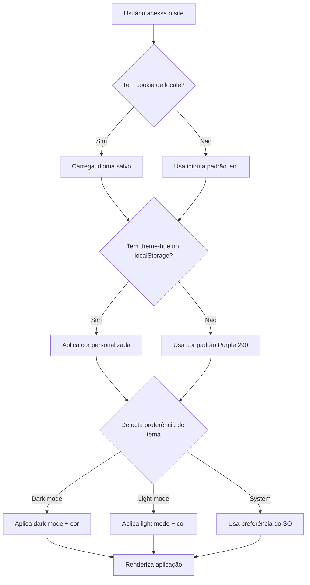

# 🎨 Sistema de Temas e Internacionalização

Documentação completa do sistema de personalização visual e internacionalização do portfólio.

---

## 📋 Índice

- [Visão Geral](#-visão-geral)
- [Sistema de Cores Dinâmicas](#-sistema-de-cores-dinâmicas)
- [Dark/Light Mode](#-darklight-mode)
- [Sistema de Internacionalização](#-sistema-de-internacionalização)
- [Arquitetura Técnica](#-arquitetura-técnica)
- [Guia de Uso](#-guia-de-uso)

---

## 🌟 Visão Geral

O portfólio possui três sistemas principais de personalização:

1. **🎨 Color Picker** - Permite ao usuário escolher entre 6 temas de cores diferentes
2. **🌓 Dark/Light Mode** - Toggle entre modo escuro e claro com animação suave
3. **🌍 Internacionalização** - Suporte para Português (PT) e Inglês (EN)

Todos esses sistemas trabalham em conjunto e mantêm as preferências do usuário usando **cookies**, garantindo persistência entre sessões e compatibilidade total com SSR.

---

## 🎨 Sistema de Cores Dinâmicas

### Componente Principal

**Arquivo:** [`src/components/animated-color-picker.tsx`](file:///c:/Users/Micro/Documents/Projects/portfolio-v2/src/components/animated-color-picker.tsx)

### Paleta de Cores Disponíveis

O sistema oferece 6 temas de cores baseados em matizes (hue) diferentes:

| Cor    | Hue | Emoji | Descrição               |
|--------|-----|-------|-------------------------|
| Purple | 290 | 💜    | Roxo vibrante (padrão)  |
| Blue   | 220 | 💙    | Azul profundo            |
| Green  | 150 | 💚    | Verde fresco            |
| Orange | 30  | 🧡    | Laranja energético      |
| Pink   | 330 | 💗    | Rosa suave              |
| Teal   | 180 | 🩵    | Azul-esverdeado         |

### Como Funciona

#### 1. **Variáveis CSS Dinâmicas (OKLCH)**

O sistema usa o espaço de cor **OKLCH** para garantir cores perceptualmente uniformes:

```css
--primary: oklch(0.55 0.22 <hue>)
--primary-light: oklch(0.75 0.15 <hue>)
--primary-dark: oklch(0.40 0.25 <hue>)
--accent: oklch(0.96 0.02 <hue>)
--ring: oklch(0.55 0.22 <hue>)
```

#### 2. **Adaptação ao Dark Mode**

Quando o dark mode está ativo, os valores são automaticamente ajustados:

```css
/* Dark Mode */
--primary: oklch(0.70 0.20 <hue>)
--primary-light: oklch(0.80 0.15 <hue>)
--primary-dark: oklch(0.50 0.22 <hue>)
```

#### 3. **Persistência**

- A escolha do usuário é salva em **cookies** com a chave `theme-hue`
- Cookie válido por 1 ano (`max-age=31536000`)
- O tema é lido **no servidor** via `cookies()` do Next.js
- As cores são aplicadas **diretamente no HTML** via inline styles
- **Sem `dangerouslySetInnerHTML` com scripts** - mais seguro!
- Completamente SSR-safe - funciona perfeitamente com Server Components

### Prevenção de Flash (FOUC)

**Arquivo:** [`src/app/layout.tsx`](file:///c:/Users/Micro/Documents/Projects/portfolio-v2/src/app/layout.tsx)

A nova abordagem elimina o uso de scripts perigosos:

```typescript
// Lê o cookie no servidor (RSC)
const cookieStore = await cookies();
const themeHue = cookieStore.get("theme-hue")?.value;
const hue = themeHue ? parseInt(themeHue, 10) : 290;

// Aplica cores diretamente no elemento HTML
<html style={{
  '--primary': `oklch(0.55 0.22 ${hue})`,
  '--primary-light': `oklch(0.75 0.15 ${hue})`,
  // ... outras propriedades
}}>
  <head>
    {/* CSS para dark mode via classe */}
    <style dangerouslySetInnerHTML={{
      __html: `.dark {
        --primary: oklch(0.70 0.20 ${hue});
        // ...
      }`
    }} />
  </head>
</html>
```

**Vantagens dessa abordagem:**
- ✅ Sem execução de JavaScript inline perigoso
- ✅ Cores aplicadas antes da renderização (zero FOUC)
- ✅ Funciona com Next.js Server Components
- ✅ Mais seguro (sem `eval` ou scripts inline)
- ✅ CSP-friendly (Content Security Policy)

### Interface do Color Picker

#### Características:

- ✅ Modal centralizado com animação de spring suave (Framer Motion)
- ✅ 6 opções de cores em grid 3x3
- ✅ Indicador visual da cor selecionada com checkmark animado
- ✅ Seta decorativa conectando botão ao modal
- ✅ Preview da cor atual no header do modal
- ✅ Totalmente internacionalizado
- ✅ Backdrop com blur para fechar o modal

#### Animações:

```typescript
// Modal entrance/exit
initial={{ opacity: 0, scale: 0.95, y: -10, x: "-50%" }}
animate={{ opacity: 1, scale: 1, y: 0, x: "-50%" }}
exit={{ opacity: 0, scale: 0.95, y: -10, x: "-50%" }}

// Color selection indicator
layoutId="selected-color-bg" // Smooth transition between colors
```

---

## 🌓 Dark/Light Mode

### Componente Principal

**Arquivo:** [`src/components/animated-theme-toggler.tsx`](file:///c:/Users/Micro/Documents/Projects/portfolio-v2/src/components/animated-theme-toggler.tsx)

### Tecnologias Utilizadas

- **next-themes** - Gerenciamento de temas com SSR support
- **View Transitions API** - Animação circular suave na transição

### Como Funciona

#### 1. **ThemeProvider Setup**

**Arquivo:** [`src/components/theme-provider.tsx`](file:///c:/Users/Micro/Documents/Projects/portfolio-v2/src/components/theme-provider.tsx)

```tsx
<ThemeProvider
  attribute="class"           // Usa classe 'dark' no <html>
  defaultTheme="system"       // Respeita preferência do SO
  enableSystem                // Detecta tema do sistema
  disableTransitionOnChange   // Evita transições indesejadas
>
```

#### 2. **Animação Circular (View Transition)**

A transição entre dark/light usa a **View Transitions API** do navegador:

```typescript
await document.startViewTransition(() => {
  document.documentElement.classList.toggle("dark");
  localStorage.setItem("theme", newTheme ? "dark" : "light");
}).ready;

// Animação circular expandindo do botão
document.documentElement.animate({
  clipPath: [
    `circle(0px at ${x}px ${y}px)`,
    `circle(${maxRadius}px at ${x}px ${y}px)`,
  ],
}, {
  duration: 500,
  pseudoElement: "::view-transition-new(root)",
});
```

#### 3. **Ícones Dinâmicos**

- 🌙 **Moon** - Mostrado em light mode (clicar ativa dark mode)
- ☀️ **Sun** - Mostrado em dark mode (clicar ativa light mode)

#### 4. **Sincronização Automática**

O componente usa `MutationObserver` para detectar mudanças na classe `dark`:

```typescript
const observer = new MutationObserver(updateTheme);
observer.observe(document.documentElement, {
  attributes: true,
  attributeFilter: ["class"],
});
```

### Integração com Color Picker

O Color Picker detecta automaticamente o modo atual e ajusta as cores:

```typescript
const isDark = root.classList.contains("dark");
if (isDark) {
  // Cores mais claras para dark mode
  root.style.setProperty("--primary", `oklch(0.70 0.20 ${hue})`);
}
```

---

## 🌍 Sistema de Internacionalização

### Tecnologia: next-intl

O projeto usa **next-intl** para internacionalização robusta com suporte a SSR.

### Idiomas Suportidos

- 🇧🇷 **Português (pt)** - Idioma padrão
- 🇺🇸 **Inglês (en)**

### Estrutura de Arquivos

```
messages/
├── pt.json    # Traduções em português
└── en.json    # Traduções em inglês

src/i18n/
└── request.ts # Configuração do next-intl
```

### Arquivos de Tradução

#### [`messages/pt.json`](file:///c:/Users/Micro/Documents/Projects/portfolio-v2/messages/pt.json)

```json
{
  "header": {
    "logo": "ES",
    "home": "Início",
    "about": "Sobre",
    "experience": "Experiência",
    "projects": "Projetos",
    "skills": "Habilidades",
    "contact": "Contato"
  },
  "colorPicker": {
    "title": "Escolha Seu Tema",
    "subtitle": "Escolha sua cor favorita",
    "ariaLabel": "Alterar cor do tema"
  }
}
```

#### [`messages/en.json`](file:///c:/Users/Micro/Documents/Projects/portfolio-v2/messages/en.json)

```json
{
  "header": {
    "logo": "ES",
    "home": "Home",
    "about": "About",
    "experience": "Experience",
    "projects": "Projects",
    "skills": "Skills",
    "contact": "Contact"
  },
  "colorPicker": {
    "title": "Choose Your Theme",
    "subtitle": "Pick your favorite color",
    "ariaLabel": "Change theme color"
  }
}
```

### Componente de Toggle de Idioma

**Arquivo:** [`src/components/language-toggler.tsx`](file:///c:/Users/Micro/Documents/Projects/portfolio-v2/src/components/language-toggler.tsx)

#### Características:

- ✅ Badge com idioma atual (PT/EN)
- ✅ Ícone de globo 🌍
- ✅ Troca instantânea com reload da página
- ✅ Persistência via cookie
- ✅ Suporte a query parameter `?lang=en` ou `?lang=pt`

#### Funcionamento:

```typescript
const toggleLanguage = () => {
  const newLocale = locale === "pt" ? "en" : "pt";
  
  // Salva no cookie (válido por 1 ano)
  document.cookie = `locale=${newLocale}; path=/; max-age=31536000`;
  
  // Adiciona query param e recarrega
  const url = new URL(window.location.href);
  url.searchParams.set("lang", newLocale);
  window.location.href = url.toString();
};
```

### Configuração do next-intl

**Arquivo:** [`src/i18n/request.ts`](file:///c:/Users/Micro/Documents/Projects/portfolio-v2/src/i18n/request.ts)

```typescript
export default getRequestConfig(async () => {
  const store = await cookies();
  
  // Lê locale do cookie
  const locale = store.get("locale")?.value || "en";
  
  // Valida locale (apenas 'en' ou 'pt')
  const validLocale = ["en", "pt"].includes(locale) ? locale : "en";

  return {
    locale: validLocale,
    messages: (await import(`../../messages/${validLocale}.json`)).default,
  };
});
```

### Como Usar em Componentes

#### Client Components:

```tsx
import { useTranslations } from "next-intl";

export function MyComponent() {
  const t = useTranslations("header");
  
  return <h1>{t("home")}</h1>; // "Início" ou "Home"
}
```

#### Tradução de Seções Específicas:

```tsx
const tHeader = useTranslations("header");
const tColorPicker = useTranslations("colorPicker");

return (
  <>
    <h1>{tHeader("home")}</h1>
    <p>{tColorPicker("title")}</p>
  </>
);
```

---

## 🏗️ Arquitetura Técnica

### Fluxo de Inicialização



### Stack Tecnológica

| Funcionalidade | Tecnologia | Motivo |
|----------------|------------|--------|
| Animações | Framer Motion | Animações fluidas e performáticas |
| Dark Mode | next-themes | SSR-safe, detecta sistema |
| Transições | View Transitions API | Efeito circular nativo do browser |
| i18n | next-intl | Melhor integração com Next.js App Router |
| Color System | OKLCH | Cores perceptualmente uniformes |
| Persistência | Cookies | Leitura server-side, SSR-safe, sem FOUC |

### Por que OKLCH?

**OKLCH** (Lightness, Chroma, Hue) é superior ao HSL porque:

- ✅ **Perceptualmente uniforme** - Cores com mesma luminosidade parecem igualmente brilhantes
- ✅ **Gamut amplo** - Acessa cores mais vibrantes que sRGB
- ✅ **Previsível** - Mudanças numéricas correspondem a mudanças visuais consistentes
- ✅ **Melhor para acessibilidade** - Contraste mais confiável

Exemplo comparativo:
```css
/* HSL - Luminosidade inconsistente */
hsl(220, 50%, 50%)  /* Azul parece mais escuro */
hsl(60, 50%, 50%)   /* Amarelo parece mais claro */

/* OKLCH - Luminosidade consistente */
oklch(0.55 0.22 220)  /* Azul */
oklch(0.55 0.22 60)   /* Amarelo */
/* Ambos têm a MESMA luminosidade perceptual (0.55) */
```

---

## 📖 Guia de Uso

### Para Desenvolvedores

#### Adicionar Nova Cor ao Picker

1. Edite [`animated-color-picker.tsx`](file:///c:/Users/Micro/Documents/Projects/portfolio-v2/src/components/animated-color-picker.tsx)
2. Adicione à array `COLOR_PRESETS`:

```typescript
const COLOR_PRESETS = [
  // ... cores existentes
  { name: "Red", hue: 0, label: "❤️" },
];
```

3. Ajuste o grid se necessário (atualmente 3 colunas):

```tsx
<div className="grid grid-cols-3 gap-3">
```

#### Adicionar Nova Chave de Tradução

1. Adicione em [`messages/pt.json`](file:///c:/Users/Micro/Documents/Projects/portfolio-v2/messages/pt.json):

```json
{
  "footer": {
    "copyright": "Todos os direitos reservados"
  }
}
```

2. Adicione em [`messages/en.json`](file:///c:/Users/Micro/Documents/Projects/portfolio-v2/messages/en.json):

```json
{
  "footer": {
    "copyright": "All rights reserved"
  }
}
```

3. Use no componente:

```tsx
const t = useTranslations("footer");
<p>{t("copyright")}</p>
```

#### Adicionar Novo Idioma

1. Crie `messages/es.json` (exemplo para espanhol)
2. Adicione validação em [`i18n/request.ts`](file:///c:/Users/Micro/Documents/Projects/portfolio-v2/src/i18n/request.ts):

```typescript
const validLocale = ["en", "pt", "es"].includes(locale) ? locale : "en";
```

3. Atualize o [`language-toggler.tsx`](file:///c:/Users/Micro/Documents/Projects/portfolio-v2/src/components/language-toggler.tsx) para ciclar entre 3 idiomas

### Para Usuários

#### Mudar Idioma

1. Clique no botão com ícone 🌍
2. O badge mostra o idioma atual (PT/EN)
3. A página recarrega com o novo idioma

**Atalho:** Adicione `?lang=en` ou `?lang=pt` na URL

#### Mudar Tema de Cor

1. Clique no botão com ícone 🎨 (Palette)
2. Escolha uma das 6 cores disponíveis
3. A mudança é instantânea e persiste entre sessões

#### Alternar Dark/Light Mode

1. Clique no botão com ícone 🌙 (modo claro) ou ☀️ (modo escuro)
2. A transição é animada com efeito circular
3. O tema se mantém mesmo após fechar o navegador

---

## 🎯 Boas Práticas

### Performance

- ✅ Script inline no `<head>` previne flash de cor incorreta (FOUC)
- ✅ Animações usam `transform` e `opacity` (aceleração por GPU)
- ✅ `will-change` aplicado em elementos animados
- ✅ Debounce em eventos que causam re-render

### Acessibilidade

- ✅ Todos os botões têm `aria-label` traduzidos
- ✅ Textos ocultos com `sr-only` para leitores de tela
- ✅ Contraste de cores validado (WCAG AA)
- ✅ Suporte a navegação por teclado
- ✅ `prefers-color-scheme` respeitado por padrão

### UX

- ✅ Feedback visual imediato em todas as interações
- ✅ Animações suaves e não-intrusivas
- ✅ Estado sempre sincronizado (sem "flickering")
- ✅ Persistência de preferências entre sessões

---

## 🐛 Troubleshooting

### "Flash de cor incorreta ao carregar"

**Problema:** A cor padrão aparece brevemente antes da cor salva

**Solução:** Verifique se o script inline está presente em `layout.tsx` antes do `<body>`

### "Idioma não muda ao clicar no botão"

**Problema:** Cookie não está sendo salvo

**Solução:** 
1. Verifique se cookies estão habilitados no navegador
2. Verifique se o domínio permite cookies de first-party
3. Confirme que `SameSite=Lax` é suportado

### "Animação circular não funciona no Firefox/Safari"

**Problema:** View Transitions API não é suportada

**Solução:** A animação falha graciosamente. Para suporte universal, implemente fallback:

```typescript
if (!document.startViewTransition) {
  // Fallback sem animação
  document.documentElement.classList.toggle("dark");
  return;
}
```

### "Cores parecem diferentes no Safari"

**Problema:** OKLCH pode ter suporte limitado em browsers antigos

**Solução:** Adicione fallback em `globals.css`:

```css
:root {
  --primary: hsl(290, 50%, 50%); /* Fallback */
  --primary: oklch(0.55 0.22 290); /* Preferred */
}
```

---

## 📊 Estrutura de Componentes

```
src/
├── components/
│   ├── animated-color-picker.tsx    # 🎨 Color picker modal
│   ├── animated-theme-toggler.tsx   # 🌓 Dark/Light toggle
│   ├── language-toggler.tsx         # 🌍 Language switcher
│   ├── theme-provider.tsx           # Theme context provider
│   └── header.tsx                   # Header com todos os controles
├── i18n/
│   └── request.ts                   # next-intl configuration
├── app/
│   ├── layout.tsx                   # Root layout com providers
│   └── globals.css                  # Variáveis CSS globais
└── messages/
    ├── pt.json                      # Traduções PT
    └── en.json                      # Traduções EN
```

---

## 🚀 Próximos Passos Sugeridos

### Features Potenciais

- [ ] Adicionar mais idiomas (ES, FR, DE)
- [ ] Implementar tema de alto contraste (acessibilidade)
- [ ] Permitir cores customizadas via color picker nativo
- [ ] Salvar preferências de usuário no backend (autenticados)
- [ ] Adicionar preview do tema antes de aplicar
- [ ] Implementar temas pré-montados (Dracula, Nord, etc)

### Melhorias Técnicas

- [ ] Adicionar testes unitários para theme switching
- [ ] Implementar analytics para cores mais populares
- [ ] Criar Storybook para demonstrar todos os componentes
- [ ] Adicionar documentação de API com TypeDoc
- [ ] Implementar fallback gracioso para browsers sem OKLCH support

---

## 📝 Changelog

### v1.0.0 (Atual)
- ✅ Sistema de cores dinâmicas com 6 temas
- ✅ Dark/Light mode com animação circular
- ✅ Internacionalização PT/EN
- ✅ Persistência de preferências
- ✅ Prevenção de FOUC
- ✅ Totalmente acessível (WCAG AA)

---

## 🤝 Contribuindo

Para adicionar novas traduções ou cores:

1. Siga o padrão existente nos arquivos
2. Teste em ambos os temas (dark/light)
3. Valide acessibilidade com contrast checker
4. Atualize esta documentação

---

**Desenvolvido com ❤️ usando Next.js, Framer Motion e next-intl**
